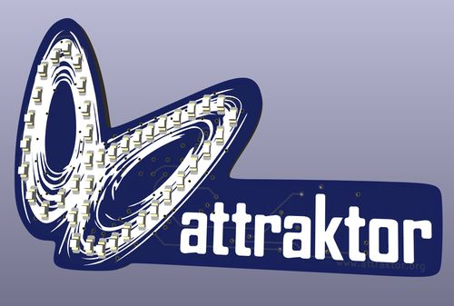
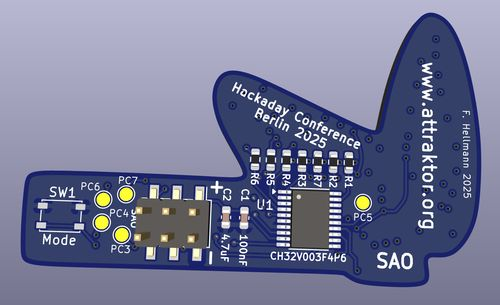

# SAO_Attraktor
Attraktor Logo as a SAO (Shitty / Supercon Add On)

KiCAD 8.0 Project with Schematics, PCB, Gerbers and Testcode 
for the Attraktor SAO PCB we show at the Hackaday Conference 2025.

Runs the pixel animation on the Attraktor SAO Badge

The Arduino code works with the following CH32V003 MCUs from the board manager:
  - CH32 MCU EVT Boards 1.0.4 or later (WCHLinkRV driver)
  - or WCH32 Boards 0.0.2 (WinUSB driver) 

Upload needs the CH32V003 WCH-LinkE dongle in RISC-V mode.

For the SAO Board to work correctly you need to reflash the MCU 
with the WCH-LinkUtility once to disable the NRST functionality on pin PD7:

  "Disable mul-func, PD7 is used for IO func"

Beware that the Eval Boards use pin PA1 and PA2 for external clock crystal 
and PD7 for Reset and therefore cannot be used for testing. Pin PD1 is 
used for programming via SWDIO
